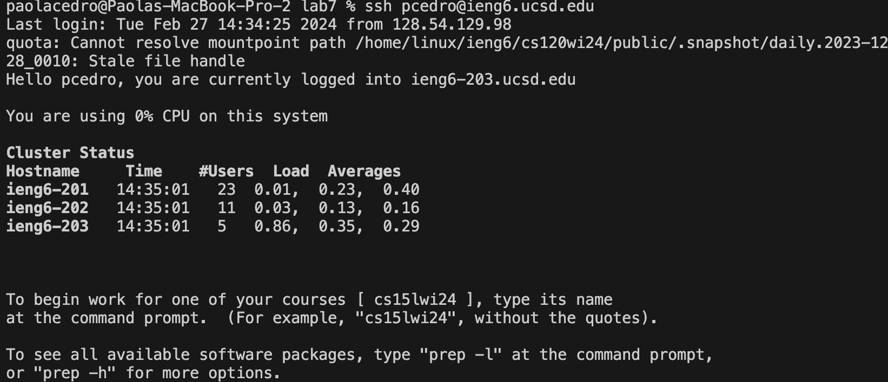
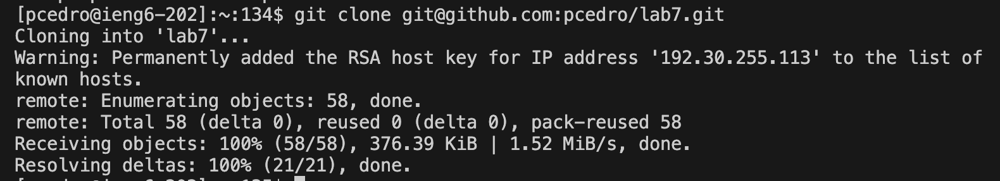
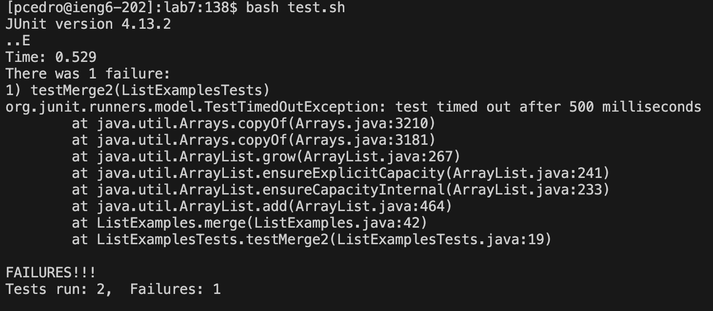
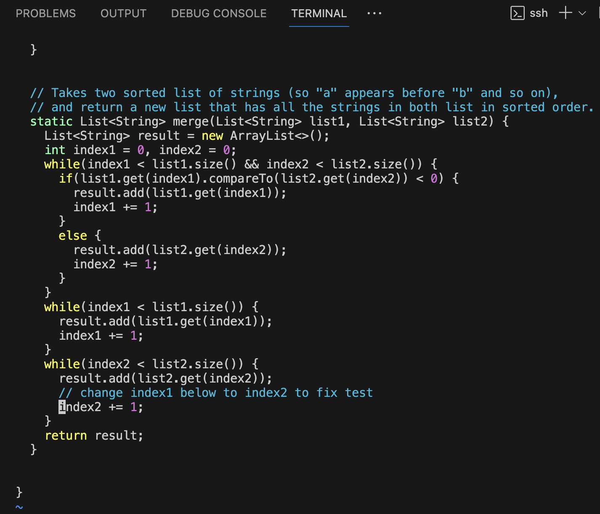
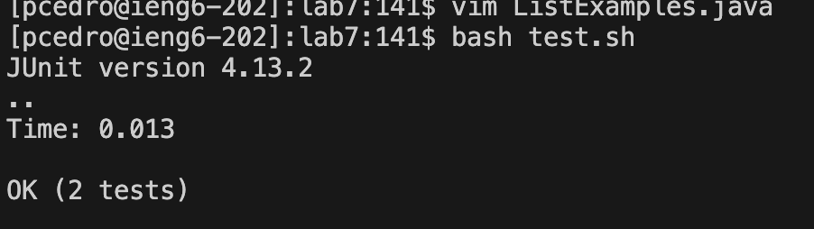
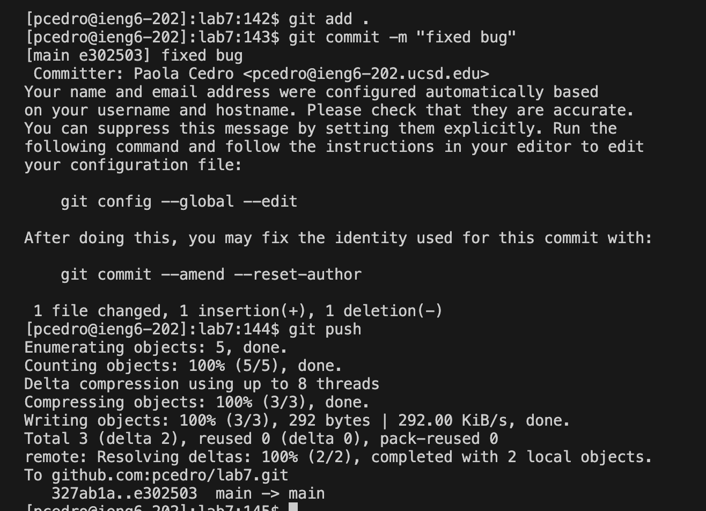

# CSE15L Lab Report 4
## Vim
__4. Logging into SSH__

```
Keys pressed: ssh <space> pcedro@ieng6.ucsd.edu <enter>
```
- As my account for ieng6 already has a private ssh key connected to my local machine, I do not need to enter the password when logging in. Thus, I only need to ssh my ieng6 account in the terminal to log in to my ssh account.

__5. Clone your fork of the repository from your Github account (using the SSH URL)__

```
Keys pressed: git <space> clone <space> git@github.com/pcedro/lab7.git <enter>
```
- Since I connected my SSH key to my Github account, I am able to clone the repository using a SSH cloning url. This is important as I can clone and push to the repository from the terminal.

__6. Run the tests, demonstrating that they fail__

```
Keys pressed: bash <space> test.sh <enter>
```
- As there is a bash test script already in the file, I used the command bash test.sh to compilie all the files and run the test file ListExamplesTest.java. As a result, the test script ran the tests and reported that one has failed.

__7. Edit the code file to fix the failing test__

```
Keys pressed: 6k 6l ce index2 <esc> :wq! <enter>
```
- In the terminal for vim, I was 6 lines below and 6 lines to the left of the line that I had to modify. Thus, by doing 6k 6l it allowed me to jump right to the i of "index1". The command ce deletes the whole word that it is on, so I deleted the word "index1" and then replaced it with "index2". I pressed the escape button to exit the insert mode, and then saved the edits in vim and quit by doing ":wq!".

__8. Run the tests, demonstrating that they now succeed__

```
Keys pressed: bash <space> test.sh <enter>
```
- Furthermore, I ran the bash test script for the test file, and it showed that the tests were successful when run and passed.

__9. Commit and push the resulting change to your Github account (you can pick any commit message!)__

```
Keys pressed: git <space> add <space> . <enter>
git <space> commit <space> -m <space> "fixed bug" <enter>
 git <space> push <enter>
```
- Here, I used multiple commands to commit and push the change to my Github account. The command "git add" adds a change in the working directory and the dot at the end refers to all files. Next, I did another command to commit the change with a message by doing "git commit -m <message>". Lastly, I did the command git push, which allowed me to push the commited changes to the remote repository in Github.
